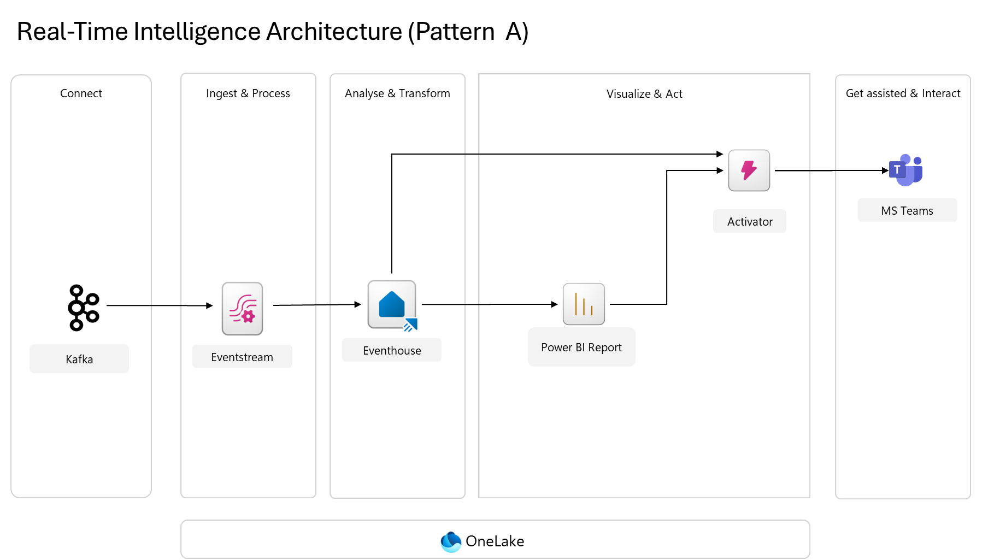
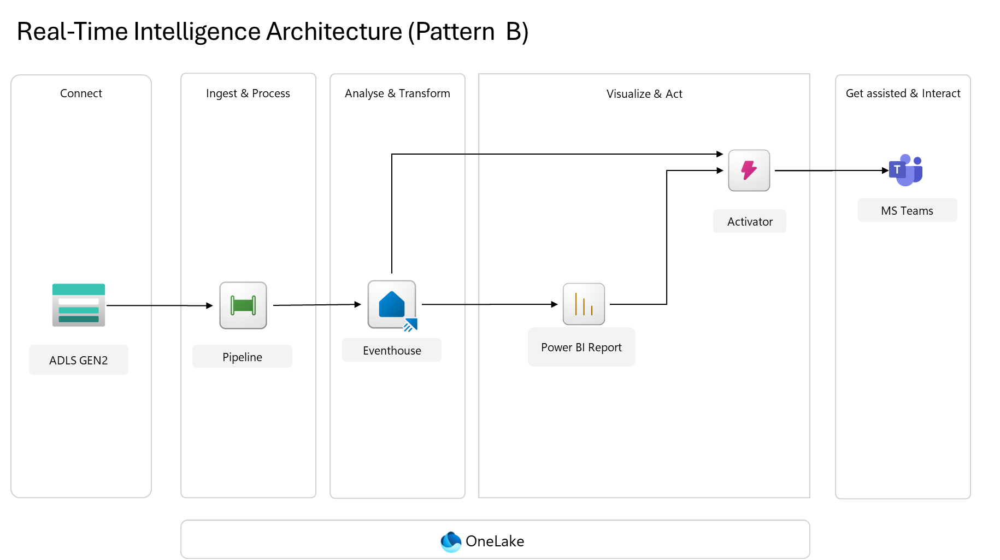
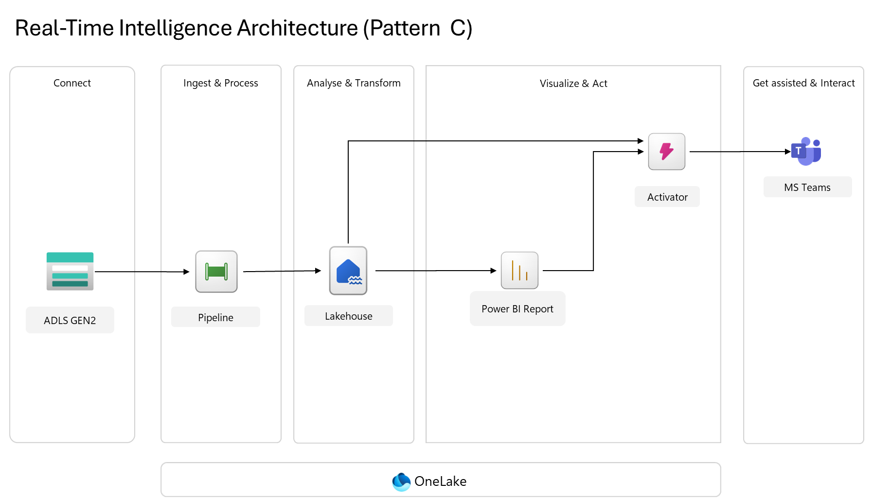
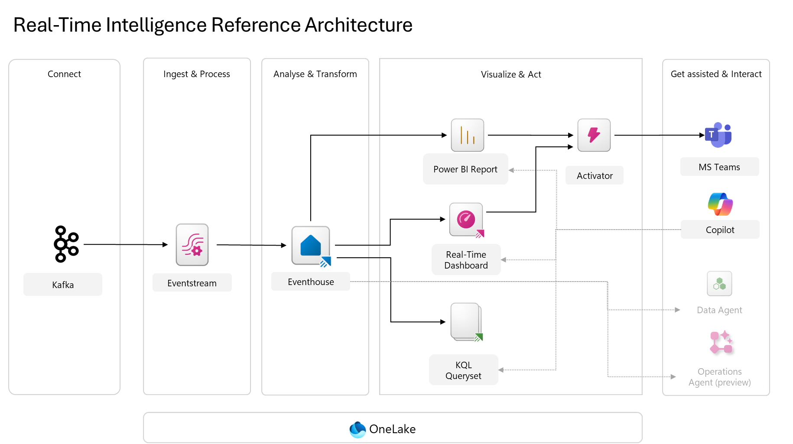

# RTI Intraday Deposit Movement

**Microsoft Fabric Real-Time Intelligence — Pattern B**
ADLS Gen2 → Fabric Data Pipeline (event-triggered) → Eventhouse (KQL DB) → Power BI → Activator → MS Teams

A modular, hands-on workshop series that builds a near-real-time intraday deposit monitoring solution on Microsoft Fabric using **Pattern B** (Eventhouse-centric RTI). Designed to be completed sequentially from Workshop 00 to Workshop 09.

> 🖱️ **Portal-first design** — every workshop is written for **analyst end-users** working in a browser (Azure Portal + Fabric Portal + Power BI). No Azure CLI or PowerShell is required for the happy path. The `scripts/` folders retain optional automation for platform engineers.

---

## The Story

A retail bank needs **near real-time visibility** into intraday deposit movements (credits, debits, net flows) across channels (ATM, BCMS, ENET) and products. CSV extracts land in ADLS Gen2 every **10 minutes**. The operations team needs:

- Dashboards that refresh within a minute
- Automated alerts to Teams when large net outflows or ingestion failures occur
- Full auditability of which file produced which rows (system columns)

This workshop series walks through building that solution end-to-end.

---

## Workshop Modules

| # | Module | Fabric Component | Description |
|---|---|---|---|
| 00 | [Prerequisites & Trusted Workspace Access](workshops/00-prerequisites/) | — | Azure / Fabric readiness + workspace identity + resource instance rule |
| 01 | [Provision ADLS Gen2](workshops/01-provision-adls-gen2/) | Azure Storage | Firewall-enabled storage account + container |
| 02 | [Eventhouse, KQL Table & Warehouse Control](workshops/02-eventhouse-kql-tables/) | Eventhouse / KQL DB + Fabric Warehouse | `DepositMovement` (KQL) + `dbo.ProcessedFiles` (Warehouse) |
| 03 | [Create the Summary Table](workshops/03-create-summary-table/) | Eventhouse / KQL DB | `Summary_Alert_Channel` (Gold) — stored procedure or materialized view |
| 04 | [Data Pipeline](workshops/04-data-pipeline/) | Data Factory | Hardened, idempotent ingestion pipeline |
| 05 | [Event Trigger](workshops/05-event-trigger/) | Eventstream + Reflex | `BlobCreated` → pipeline wire-up |
| 06 | [Simulate Ingestion](workshops/06-simulate-ingestion/) | PowerShell / AzCopy | Replay 16 CSVs (real or accelerated) |
| 07 | [Power BI Report](workshops/07-powerbi-report/) | Power BI (+ optional RTD) | DirectQuery KPI report with 30s refresh |
| 08 | [Activator Alerts](workshops/08-activator-alerts/) | Data Activator | KQL-driven Teams notifications |
| 09 | [Validate & Monitor](workshops/09-validate-monitor/) | Monitor hub | End-to-end checklist + housekeeping |

---

## Getting Started

### Prerequisites

- Microsoft Fabric **F-SKU** capacity (not Trial) — Trusted Workspace Access requires F-SKU
- Azure subscription with **Contributor** on the target resource group
- Role **User Access Administrator** or **Owner** on the storage account scope (for RBAC assignment)
- Azure CLI ≥ 2.60 and Az PowerShell ≥ 11
- Access to a Microsoft Teams channel (Workshop 08)

### How to Use

1. Clone this repository:
   ```bash
   git clone https://github.com/ChettapongP-MFST/RTI-IntradayDepositMovement.git
   ```
2. Start with [`workshops/00-prerequisites/`](workshops/00-prerequisites/) and complete modules in order (00 → 09).
3. Each workshop has its own `README.md` with step-by-step instructions, code snippets, and exit criteria.
4. Sample CSVs are in [`resources/datasets/`](resources/datasets/) (16 files × 30-min slots).

---

## Repository Structure

```
RTI-IntradayDepositMovement/
├── workshops/
│   ├── 00-prerequisites/
│   │   └── scripts/
│   ├── 01-provision-adls-gen2/
│   │   └── scripts/
│   ├── 02-eventhouse-kql-tables/
│   │   └── kql/
│   ├── 03-create-summary-table/
│   │   └── kql/
│   ├── 04-data-pipeline/
│   │   └── pipeline/
│   ├── 05-event-trigger/
│   ├── 06-simulate-ingestion/
│   │   └── scripts/
│   ├── 07-powerbi-report/
│   ├── 08-activator-alerts/
│   └── 09-validate-monitor/
├── resources/
│   └── datasets/          # 16 mock CSVs (30-min intraday slots)
├── images/                # Architecture diagrams & screenshots
├── .gitignore
├── LICENSE
└── README.md
```

---

## Target Architecture


**Flow** — `Connect` (ADLS Gen2) → `Ingest & Process` (Fabric Data Pipeline, event-triggered) → `Analyse & Transform` (Eventhouse / KQL DB) → `Visualize & Act` (Power BI report + Activator) → `Get assisted & Interact` (MS Teams). All Fabric items are backed by **OneLake**.

Key design principles:

- **Event-driven**: `Microsoft.Storage.BlobCreated` triggers the pipeline immediately when a file lands.
- **Idempotent**: `dbo.ProcessedFiles` control table in a Fabric Warehouse + KQL `ingest-by` tag prevent duplicate loads.
- **Traceable**: Every business row carries four **system columns** — `load_ts`, `file_name`, `pipeline_name`, `pipeline_runid` — injected by the pipeline.
- **Secured**: ADLS Gen2 firewalled; Fabric reaches it via **Trusted Workspace Access** (resource instance rule).

---

## Fabric RTI Architecture Patterns — Overview & Comparison

Microsoft Fabric Real-Time Intelligence supports several architecture patterns. This section compares them and explains why **Pattern B** was chosen for this use case.

### Pattern A — Streaming (Kafka / Event Hubs → Eventstream → Eventhouse)



- **Source:** true streaming — Kafka, Event Hubs, IoT Hub, MQTT, CDC feeds, Pub/Sub.
- **Ingest:** no-code Eventstream (filter / aggregate / join in-flight).
- **Store:** Eventhouse / KQL DB.
- **Latency:** ~1–5 seconds source → queryable.
- **Best for:** IoT telemetry, clickstream, fraud, logs, AI/agent telemetry, content-safety signals.
- **Trade-off:** highest throughput & lowest latency, but continuous CU consumption and a Kafka-compatible producer is required.

### Pattern B — Event-driven Batch (ADLS Gen2 → Pipeline → Eventhouse) ⭐ *(this repo)*



- **Source:** files (CSV / JSON / Parquet) landing in ADLS Gen2 or OneLake.
- **Ingest:** Data Pipeline triggered by `Microsoft.Storage.BlobCreated`.
- **Store:** Eventhouse / KQL DB.
- **Latency:** ~15–60 seconds file-land → Power BI.
- **Best for:** scheduled / semi-batch extracts (5/10/15/30-min drops), core-banking / ERP exports, bank intraday monitoring.
- **Trade-off:** pay-per-run (very low idle cost) + full ETL control (Lookup / If / Copy) + easy system-column traceability — but not suited for sub-second latency.

### Pattern C — Event-driven Batch (ADLS Gen2 → Pipeline → Lakehouse)



- **Source:** same as Pattern B.
- **Store:** **Lakehouse** (Delta Lake + SQL endpoint).
- **Latency:** ~1–10 minutes (Delta commit + caching).
- **Best for:** historical warehouse, medallion architecture, large dim joins, ML feature stores, data marts.
- **Trade-off:** not optimized for hot-path time-series queries; Power BI 30-s APR is not practical over Lakehouse.

### Reference Architecture — "Everything together"



A superset showing Eventstream + Eventhouse feeding **all four serving surfaces** (Power BI Report, Real-Time Dashboard, KQL Queryset) plus Activator + Copilot + Data Agent + Operations Agent. Use it as the long-term target and pick A/B/C subsets per workload.

### Side-by-side comparison

| Criterion | Pattern A (Stream) | **Pattern B (File-event)** ⭐ | Pattern C (Lakehouse) |
|---|---|---|---|
| Source shape | Continuous stream | Files on cadence | Files on cadence |
| Typical source | Kafka / EH / IoT / CDC | ADLS CSV / JSON / Parquet | ADLS CSV / JSON / Parquet |
| Ingest tool | Eventstream | **Data Pipeline** | Data Pipeline |
| Landing store | Eventhouse (KQL) | **Eventhouse (KQL)** | Lakehouse (Delta) |
| End-to-end latency | 1–5 s | **15–60 s** | 1–10 min |
| Hot query (point / filter) | ⚡⚡⚡ | ⚡⚡⚡ | ⚡⚡ |
| Power BI APR ≤ 30 s | ✅ | ✅ | ⚠️ |
| ETL control (dedup / audit / retry) | Medium | **High** | High |
| File-level idempotency | Complex | **Native** (`ingest-by` + control table) | Manual MERGE |
| Cost at rest | $$$ | **$** | $$ |
| Ops skill required | Streaming engineer | **Data engineer** | Lake engineer |
| System columns per file | Harder | **Trivial** (pipeline params) | Moderate |

### Recommendation — why Pattern B fits this use case best

The business scenario is: **core-banking extracts land every 10 minutes as CSV in ADLS Gen2**; operations needs dashboards refreshing within a minute and Teams alerts on anomalies.

1. **Source reality** — the upstream is file-based, not streaming. Forcing Kafka (Pattern A) would be a costly retrofit.
2. **Latency SLA** — ops need < 1 min; Pattern B delivers 15–60 s comfortably. Pattern A's 1-sec latency exceeds the SLA at higher cost; Pattern C's 1–10 min may miss it.
3. **Cost** — Pattern B pays only on file arrival (~144 runs/day), orders of magnitude cheaper than a continuous Eventstream.
4. **Governance & audit** — banks need "which file produced which rows". Pipelines give this natively via the `dbo.ProcessedFiles` control table (Fabric Warehouse, queryable via T-SQL) + system columns on the KQL business table.
5. **Idempotency** — `Get Metadata → Lookup → If → Copy (ingest-by tag)` is the canonical pattern and maps 1-to-1 to Pattern B.
6. **Operational simplicity** — existing data engineers already know pipelines; no new streaming runtime to operate.
7. **Hot query path preserved** — KQL still powers 30-s Power BI APR and sub-second Activator evaluation.

### 🧭 When to evolve

| Future trigger | Move to |
|---|---|
| Upstream begins emitting Kafka / Event Hubs | Pattern A |
| File cadence < 1 min or SLA < 5 s | Pattern A |
| Need long-term cross-domain joins (customer MDM, ML features) | Hybrid — enable **OneLake availability** on the Eventhouse so data is simultaneously queryable as Delta |
| Add Copilot / Data Agent / Operations Agent | Reference Architecture |

The **balanced hybrid**: once Pattern B is running, turn on OneLake availability on the KQL table. You get Pattern B's hot path **and** Pattern C's lake access from a single source of truth — no ingestion refactor required.

---


## Data Model

**`DepositMovement`** (business table, 16 columns):

| Category | Type | Columns |
|---|---|---|
| Grain | Data column | `Date`, `Time` |
| Dimensions | Data column | `Product`, `Channel`, `Channel_Group`, `Transaction_Type` |
| Measures | Data column | `Credit_Amount`, `Debit_Amount`, `Net_Amount`, `Credit_Txn`, `Debit_Txn`, `Total_Txn` |
| Lineage | System column | `load_ts`, `file_name`, `pipeline_name`, `pipeline_runid` |

**`wh_control_framework.dbo.ProcessedFiles`** (audit/control table, Fabric Warehouse, 8 columns):

`FileName`, `IngestedAtUtc`, `RowCount_`, `Status` (Success / Failed / Skipped-Duplicate), `PipelineName`, `PipelineRunId`, `RunAsUser`, `ErrorMsg`

> The control table lives in a **Fabric Warehouse** (not the Eventhouse) so analysts can query it with standard T-SQL, join it easily in Power BI, and keep the hot-path KQL table focused on business facts.

---

## Contributing

Contributions are welcome! Please open an issue or submit a pull request.

## License

This project is licensed under the MIT License — see the [LICENSE](LICENSE) file for details.

## References

- [Microsoft Fabric Real-Time Intelligence](https://learn.microsoft.com/en-us/fabric/real-time-intelligence/)
- [Trusted Workspace Access for ADLS Gen2](https://learn.microsoft.com/en-us/fabric/security/security-trusted-workspace-access)
- [Pipeline storage event triggers](https://learn.microsoft.com/en-us/fabric/data-factory/pipeline-runs)
