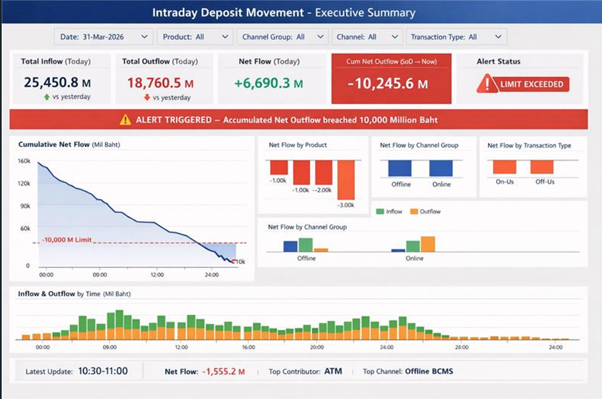

# Workshop 07 — Power BI KPI Report

Build the **Intraday Deposit Movement – Executive Summary** dashboard on Power BI over the Eventhouse in **DirectQuery** mode, with 30-second automatic page refresh.



**Prerequisite:** [Workshop 06](../06-simulate-ingestion/) complete
**Next:** [Workshop 08 — Activator Alerts](../08-activator-alerts/)

---

## 7.0 Report anatomy

Before building, understand every element on the single-page executive dashboard:

| Zone | Elements | Purpose |
|---|---|---|
| **Header** | Blue banner — *"Intraday Deposit Movement – Executive Summary"* | Report title |
| **Slicer bar** | Date · Product · Channel Group · Channel · Transaction Type | Let users drill into any dimension slice |
| **KPI cards** | Total Inflow · Total Outflow · Net Flow · Cum Net Outflow (SoD→Now) · Alert Status | At-a-glance numbers — green/red conditional formatting |
| **Alert banner** | Red bar — *"⚠ ALERT TRIGGERED — Accumulated Net Outflow breached 10,000 Million Baht"* | Conditional visibility when threshold breached |
| **Main chart** | Cumulative Net Flow (area/line) with −10,000 M limit reference line | Shows intraday trend declining toward the danger zone |
| **Breakdown charts** | Net Flow by Product · by Channel Group · by Transaction Type · by Channel Group (with Channel detail) | Dimension breakdown bars — Inflow (green) vs Outflow (orange) |
| **Timeline chart** | Inflow & Outflow by Time (stacked bar, 30-min intervals) | Granular time-series view of deposit activity |
| **Footer bar** | Latest Update · Net Flow · Top Contributor · Top Channel | Real-time status strip |

---

## 7.1 Create the semantic model (DirectQuery on KQL)

### Option A — From Fabric portal (recommended)

1. Open the KQL Database `DepositMovement` in your Fabric workspace.
2. Top-right corner → **Build Power BI report**.
3. In the **Data** pane on the right, check the `DepositMovement` table.
4. The report opens in **DirectQuery** mode automatically (Eventhouse → Power BI always uses DirectQuery).

### Option B — From Power BI Desktop

1. **Home** → **Get Data** → search **Azure Data Explorer (Kusto)**.
2. **Cluster**: paste your Eventhouse **Query URI** (found on the Eventhouse overview page, e.g. `https://trd-xxxxxxx.z6.kusto.fabric.microsoft.com`).
3. **Database**: `DepositMovement`.
4. **Table**: `DepositMovement`.
5. **Data Connectivity mode**: **DirectQuery** (do **not** choose Import).
6. Click **OK** → **Load**.

> 💡 DirectQuery means every visual sends a live KQL query to the Eventhouse. No data is cached in Power BI — you always see the latest rows.

---

## 7.2 DAX measures

Create all measures in a single **Measures** table (or directly on the `DepositMovement` table). Right-click the table → **New measure** for each.

### 7.2.1 Core aggregations

```DAX
Total Inflow = 
    SUM('DepositMovement'[Credit_Amount])

Total Outflow = 
    SUM('DepositMovement'[Debit_Amount])

Net Flow = 
    SUM('DepositMovement'[Net_Amount])

Total Transactions = 
    SUM('DepositMovement'[Total_Txn])
```

### 7.2.2 Cumulative Net Outflow (SoD → Now)

This is the key measure for the center KPI card and the cumulative line chart. It calculates a running total of `Net_Amount` across all time slots from start-of-day up to the current slot.

```DAX
Cum Net Outflow = 
    CALCULATE(
        SUM('DepositMovement'[Net_Amount]),
        FILTER(
            ALL('DepositMovement'[Time]),
            'DepositMovement'[Time] <= MAX('DepositMovement'[Time])
        )
    )
```

### 7.2.3 vs Yesterday comparison

```DAX
Total Inflow Yesterday = 
    CALCULATE(
        [Total Inflow],
        DATEADD('DepositMovement'[Date], -1, DAY)
    )

Total Outflow Yesterday = 
    CALCULATE(
        [Total Outflow],
        DATEADD('DepositMovement'[Date], -1, DAY)
    )

Inflow vs Yesterday = 
    [Total Inflow] - [Total Inflow Yesterday]

Outflow vs Yesterday = 
    [Total Outflow] - [Total Outflow Yesterday]
```

### 7.2.4 Alert threshold

```DAX
Outflow Limit = -10000000000

Alert Breached = 
    IF(
        [Cum Net Outflow] <= [Outflow Limit],
        "LIMIT EXCEEDED",
        "Within Limit"
    )
```

### 7.2.5 Footer bar measures

```DAX
Latest Update = 
    MAX('DepositMovement'[Time])

Net Flow Display = 
    FORMAT([Net Flow] / 1000000, "#,##0.0") & " M"

Top Contributor = 
    VAR _tbl =
        ADDCOLUMNS(
            SUMMARIZE('DepositMovement', 'DepositMovement'[Channel]),
            "@AbsNet", ABS(CALCULATE(SUM('DepositMovement'[Net_Amount])))
        )
    RETURN
        MAXX(TOPN(1, _tbl, [@AbsNet], DESC), 'DepositMovement'[Channel])

Top Channel = 
    VAR _tbl =
        ADDCOLUMNS(
            SUMMARIZE(
                'DepositMovement',
                'DepositMovement'[Channel_Group],
                'DepositMovement'[Channel]
            ),
            "@AbsNet", ABS(CALCULATE(SUM('DepositMovement'[Net_Amount])))
        )
    VAR _top = MAXX(TOPN(1, _tbl, [@AbsNet], DESC), 'DepositMovement'[Channel_Group] & " " & 'DepositMovement'[Channel])
    RETURN _top
```

### 7.2.6 Display formatting helpers

```DAX
Inflow Mil = 
    [Total Inflow] / 1000000

Outflow Mil = 
    [Total Outflow] / 1000000

Net Flow Mil = 
    [Net Flow] / 1000000

Cum Net Outflow Mil = 
    [Cum Net Outflow] / 1000000
```

### Summary — all measures

| # | Measure | Used in |
|---|---|---|
| 1 | `Total Inflow` | KPI card |
| 2 | `Total Outflow` | KPI card |
| 3 | `Net Flow` | KPI card, footer |
| 4 | `Total Transactions` | Optional detail |
| 5 | `Cum Net Outflow` | KPI card, line chart |
| 6 | `Total Inflow Yesterday` | KPI card comparison |
| 7 | `Total Outflow Yesterday` | KPI card comparison |
| 8 | `Inflow vs Yesterday` | KPI card arrow |
| 9 | `Outflow vs Yesterday` | KPI card arrow |
| 10 | `Outflow Limit` | Reference line |
| 11 | `Alert Breached` | Alert status card, banner visibility |
| 12 | `Latest Update` | Footer |
| 13 | `Net Flow Display` | Footer |
| 14 | `Top Contributor` | Footer |
| 15 | `Top Channel` | Footer |
| 16–19 | `*_Mil` helpers | Chart axis labels in millions |

---

## 7.3 Build the report — step by step

### 7.3.1 Page setup

1. **Format page** → **Canvas settings**:
   - Type: **Custom**
   - Width: **1280** px, Height: **800** px (widescreen 16:10)
2. **Page background**: White (`#FFFFFF`)
3. **Wallpaper**: None (transparent)

### 7.3.2 Header banner

1. Insert → **Text box**.
2. Text: **Intraday Deposit Movement – Executive Summary**
3. Font: **Segoe UI Semibold**, size **18**, color **White** (`#FFFFFF`).
4. Background: **Dark blue** (`#003366`).
5. Stretch full width across the top of the canvas.

### 7.3.3 Slicer bar (5 slicers)

Create 5 **Slicer** visuals in a horizontal row below the header:

| # | Slicer field | Style | Default |
|---|---|---|---|
| 1 | `Date` | **Dropdown** | Latest date |
| 2 | `Product` | **Dropdown** | All |
| 3 | `Channel_Group` | **Dropdown** | All |
| 4 | `Channel` | **Dropdown** | All |
| 5 | `Transaction_Type` | **Dropdown** | All |

For each slicer:
1. Drag the field to the canvas → it auto-creates a slicer.
2. **Format** → **Slicer settings** → **Style**: **Dropdown**.
3. **Format** → **Slicer header** → rename to `Date:`, `Product:`, etc.
4. Arrange them horizontally, equally spaced.

### 7.3.4 KPI cards (5 cards)

Create 5 cards in a row below the slicers. Use the **Card** visual (or **Multi-row card** for each).

#### Card 1 — Total Inflow (Today)

| Setting | Value |
|---|---|
| Visual | **Card** |
| Field | `[Inflow Mil]` |
| Display units | None (measure already in millions) |
| Format | `#,##0.0 "M"` |
| Font color | **Dark blue** (`#003366`) |
| Label | `Total Inflow (Today)` |
| Sub-label | `↑ vs yesterday` (use `[Inflow vs Yesterday]` conditional: green `#28A745` if positive, red `#DC3545` if negative) |

#### Card 2 — Total Outflow (Today)

| Setting | Value |
|---|---|
| Field | `[Outflow Mil]` |
| Font color | **Red** (`#DC3545`) |
| Label | `Total Outflow (Today)` |
| Sub-label | `↓ vs yesterday` with conditional coloring |

#### Card 3 — Net Flow (Today)

| Setting | Value |
|---|---|
| Field | `[Net Flow Mil]` |
| Font color | **Green** (`#28A745`) if positive, **Red** if negative |
| Format | `+#,##0.0 "M";-#,##0.0 "M"` |
| Label | `Net Flow (Today)` |

#### Card 4 — Cum Net Outflow (SoD → Now)

| Setting | Value |
|---|---|
| Field | `[Cum Net Outflow Mil]` |
| Font color | **Red** (`#DC3545`) — this is the danger metric |
| Background | Light red/orange highlight |
| Label | `Cum Net Outflow (SoD → Now)` |
| Border | Orange (`#FF6600`) |

#### Card 5 — Alert Status

| Setting | Value |
|---|---|
| Field | `[Alert Breached]` |
| Conditional: if `"LIMIT EXCEEDED"` → Background **Red** (`#DC3545`), font **White**, icon ⚠ |
| Conditional: if `"Within Limit"` → Background **Green** (`#28A745`), font **White** |

> 💡 For the ⚠ icon, use conditional formatting with icons, or a separate Image visual that toggles visibility based on `[Alert Breached]`.

### 7.3.5 Alert banner (conditional)

1. Insert → **Text box** (or **Card** visual).
2. Text: `⚠ ALERT TRIGGERED — Accumulated Net Outflow breached 10,000 Million Baht`
3. Background: **Red** (`#DC3545`), font: **White**, **Bold**.
4. Full width, positioned below the KPI cards.
5. **Conditional visibility** (optional advanced):
   - In the **Format** pane → **General** → **Show/hide** → bind to a measure:
   ```DAX
   Show Alert Banner = IF([Alert Breached] = "LIMIT EXCEEDED", 1, 0)
   ```
   - If Power BI conditional visibility is not available in your version, keep the banner always visible — its red color already signals the alert.

### 7.3.6 Cumulative Net Flow — area chart (main chart, left)

| Setting | Value |
|---|---|
| Visual type | **Area chart** (or **Line chart** with area fill) |
| X-axis | `Time` (string — 30-min slots: `00:00-00:30`, `00:30-01:00`, …) |
| Y-axis | `[Cum Net Outflow Mil]` |
| Title | `Cumulative Net Flow (Mil Baht)` |
| Line color | **Dark blue** (`#003366`) |
| Area fill | Light blue (`#CCE5FF`), opacity ~30% |

**Add the −10,000 M reference line:**

1. Select the chart → **Format** → **Analytics** → **Constant line** → **+ Add**.
2. Value: `-10000` (since Y-axis is in millions).
3. Color: **Red dashed** (`#DC3545`).
4. Label: `-10,000 M Limit`.
5. Style: **Dashed**.

### 7.3.7 Net Flow by Product — clustered bar chart (top-right area)

| Setting | Value |
|---|---|
| Visual type | **Clustered bar chart** |
| Y-axis (Category) | `Product` (Fixed, Saving, Current) |
| X-axis (Values) | `[Inflow Mil]` and `[Outflow Mil]` (or `[Total Inflow]` and `[Total Outflow]` with display units = Millions) |
| Legend | Inflow = **Green** (`#28A745`), Outflow = **Orange** (`#FF8C00`) |
| Title | `Net Flow by Product` |
| Data labels | On |

### 7.3.8 Net Flow by Channel Group — clustered bar chart

| Setting | Value |
|---|---|
| Visual type | **Clustered bar chart** |
| Y-axis (Category) | `Channel_Group` (Offline, Online) |
| X-axis (Values) | `[Inflow Mil]`, `[Outflow Mil]` |
| Colors | Inflow = **Green**, Outflow = **Orange** |
| Title | `Net Flow by Channel Group` |

### 7.3.9 Net Flow by Transaction Type — clustered bar chart

| Setting | Value |
|---|---|
| Visual type | **Clustered bar chart** |
| Y-axis (Category) | `Transaction_Type` (On-Us, Off-Us) |
| X-axis (Values) | `[Inflow Mil]`, `[Outflow Mil]` |
| Colors | Inflow = **Green**, Outflow = **Orange** |
| Title | `Net Flow by Transaction Type` |

### 7.3.10 Net Flow by Channel Group (with Channel detail) — grouped bar chart

| Setting | Value |
|---|---|
| Visual type | **Clustered bar chart** |
| Y-axis (Category) | `Channel` (ATM, BCMS, ENET, TELL) |
| Legend | `Channel_Group` (Offline = **Blue** `#003F88`, Online = appears grouped) |
| X-axis (Values) | `[Inflow Mil]`, `[Outflow Mil]` |
| Title | `Net Flow by Channel Group` |

> This chart shows Inflow (green/blue) and Outflow (orange) for each channel, grouped by Channel Group.

### 7.3.11 Inflow & Outflow by Time — stacked bar chart (bottom)

| Setting | Value |
|---|---|
| Visual type | **Stacked bar chart** (horizontal) or **Stacked column chart** (vertical — matches the screenshot) |
| X-axis | `Time` (48 time slots) |
| Y-axis (Values) | `[Inflow Mil]` and `[Outflow Mil]` |
| Colors | Inflow = **Green** (`#28A745`), Outflow = **Orange** (`#FF8C00`) |
| Title | `Inflow & Outflow by Time (Mil Baht)` |
| Data labels | Off (too many bars) |
| Sort | By `Time` ascending |

> This is the widest visual — stretch it full width across the bottom, just above the footer.

### 7.3.12 Footer bar (status strip)

Create a horizontal strip at the very bottom using 4 **Card** visuals (or a **Multi-row card**) on a gray/dark background text box:

| Element | Field/Measure | Format |
|---|---|---|
| **Latest Update:** | `[Latest Update]` | e.g. `10:30-11:00` |
| **Net Flow:** | `[Net Flow Display]` | Red if negative (e.g. `-1,555.2 M`) |
| **Top Contributor:** | `[Top Contributor]` | Bold, e.g. `ATM` |
| **Top Channel:** | `[Top Channel]` | Bold, e.g. `Offline BCMS` |

Background: **Light gray** (`#F2F2F2`) with a subtle top border.

---

## 7.4 Color palette reference

Keep visuals consistent with these colors throughout the report:

| Element | Color | Hex |
|---|---|---|
| Header / dark blue | Navy | `#003366` |
| Inflow (credit) | Green | `#28A745` |
| Outflow (debit) | Orange | `#FF8C00` |
| Negative / danger | Red | `#DC3545` |
| Positive | Green | `#28A745` |
| Reference line | Red dashed | `#DC3545` |
| Alert banner | Red background | `#DC3545` |
| Alert card (within limit) | Green | `#28A745` |
| Cum Net Outflow highlight | Orange border | `#FF6600` |
| Footer background | Light gray | `#F2F2F2` |
| Offline group | Dark blue | `#003F88` |
| Online group | Blue | `#0066CC` |

---

## 7.5 Enable Automatic Page Refresh (APR)

This is critical — without APR, users must manually refresh to see new data.

1. Select the report canvas (click on empty space).
2. **Format pane** → **Page information** → **Page refresh**:
   - Toggle: **On**
   - Type: **Fixed interval**
   - Interval: **30 seconds**
3. Click **Apply**.

> ⚠ APR requires **DirectQuery** mode. If you used Import, APR won't work. The Eventhouse connector always uses DirectQuery, so this should work automatically.

> 💡 If visuals are slow (many DAX measures), increase to **1 minute**. For a simple dashboard with 5 KPI cards and a few charts, 30 seconds is fine.

---

## 7.6 Publish

1. **File** → **Save** the report (or **Ctrl+S**).
2. If using Power BI Desktop: **Home** → **Publish** → select your Fabric workspace.
3. If using Fabric portal: the report auto-saves to the workspace.
4. Share access:
   - **Viewer** role for operations staff (read-only dashboard).
   - **Contributor** role for report editors.

---

## 7.7 (Optional) Real-Time Dashboard (RTD)

As an alternative to Power BI (or as a complement), create an RTD inside the Eventhouse for sub-second refresh:

1. Open the Eventhouse → **+ New Real-Time Dashboard**.
2. Name it `RTD – Intraday Deposit Movement`.
3. Add tiles using KQL queries:

**Tile 1 — Cumulative Net by Time:**
```kusto
DepositMovement
| where Date == startofday(now())
| summarize Net = sum(Net_Amount) by Time
| order by Time asc
| extend CumNet = row_cumsum(Net)
| project Time, CumNet
| render areachart with (title="Cumulative Net Flow")
```

**Tile 2 — Net by Channel:**
```kusto
DepositMovement
| where Date == startofday(now())
| summarize Inflow=sum(Credit_Amount), Outflow=sum(Debit_Amount) by Channel
| render barchart with (title="Net Flow by Channel")
```

**Tile 3 — Alert check:**
```kusto
DepositMovement
| where Date == startofday(now())
| summarize Net = sum(Net_Amount) by Time
| order by Time asc
| extend CumNet = row_cumsum(Net)
| summarize LatestCum = arg_max(Time, CumNet)
| extend Alert = iff(CumNet <= -10000000000, "⚠ LIMIT EXCEEDED", "✅ Within Limit")
| project Alert, CumNet
```

4. RTD refreshes automatically — no APR config needed.
5. RTD tiles can trigger **Data Activator** alerts directly (Workshop 08).

---

## ✅ Exit Criteria

- [ ] Power BI report published with **DirectQuery** on KQL
- [ ] **5 slicers** work: Date, Product, Channel Group, Channel, Transaction Type
- [ ] **5 KPI cards** show: Total Inflow, Total Outflow, Net Flow, Cum Net Outflow, Alert Status
- [ ] **Alert banner** appears when cumulative outflow breaches −10,000 M
- [ ] **Cumulative Net Flow** area chart with −10,000 M reference line renders correctly
- [ ] **4 breakdown charts** show Net Flow by Product / Channel Group / Transaction Type / Channel
- [ ] **Inflow & Outflow by Time** stacked bar shows all 48 time slots
- [ ] **Footer bar** shows Latest Update, Net Flow, Top Contributor, Top Channel
- [ ] **APR = 30 seconds** is enabled and visuals refresh automatically
- [ ] Operations team has Viewer access

→ Proceed to **[Workshop 08 — Activator Alerts](../08-activator-alerts/)**

---

## 📚 Power BI Reference Links

| Concept | Documentation |
|---|---|
| DirectQuery on KQL | [Use Azure Data Explorer connector in Power BI](https://learn.microsoft.com/power-bi/transform-model/desktop-connect-azure-data-explorer) |
| Automatic page refresh (APR) | [Automatic page refresh in Power BI](https://learn.microsoft.com/power-bi/create-reports/desktop-automatic-page-refresh) |
| Card visual | [Card visual in Power BI](https://learn.microsoft.com/power-bi/visuals/power-bi-visualization-card) |
| Slicers | [Slicers in Power BI](https://learn.microsoft.com/power-bi/visuals/power-bi-visualization-slicers) |
| Conditional formatting | [Conditional formatting in Power BI](https://learn.microsoft.com/power-bi/create-reports/desktop-conditional-table-formatting) |
| Constant line (reference line) | [Analytics pane in Power BI](https://learn.microsoft.com/power-bi/transform-model/desktop-analytics-pane) |
| DAX CALCULATE | [CALCULATE function](https://learn.microsoft.com/dax/calculate-function-dax) |
| DAX DATEADD | [DATEADD function](https://learn.microsoft.com/dax/dateadd-function-dax) |
| DAX TOPN | [TOPN function](https://learn.microsoft.com/dax/topn-function-dax) |
| Real-Time Dashboard | [Real-Time Dashboard in Fabric](https://learn.microsoft.com/fabric/real-time-intelligence/dashboard-real-time-create) |
